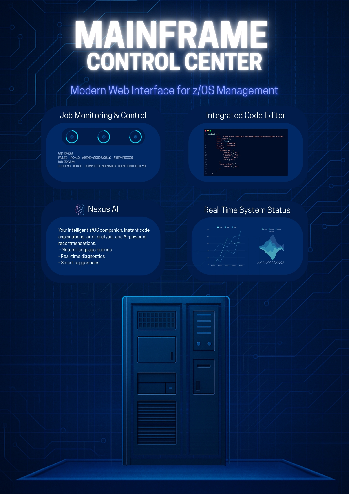

# KdG Mainframe Web Control Center


**Web-based interface for IBM Z mainframe operations**

Academic Year 2025-2026 | Karel de Grote University of Applied Sciences and Arts  
Student: Younes El Azzouzi | Applied Computer Science

---


## Overview

This project was developed as part of the mainframe curriculum at Karel de Grote University of Applied Sciences and Arts. It provides a modern web interface for managing IBM Z mainframe systems, making it easier for students and developers to work with datasets, jobs, and USS files without the traditional 3270 terminal.

## Key Features

- Modern Flask-based Web UI running on IBM z/OS USS  
- Zowe CLI integration for datasets, jobs, and USS operations  
- Browse HLQs, open PDS members, edit and save dataset content  
- Create new members and submit JCL directly from the editor  
- Job monitoring with spool viewer and return-code detection  
- USS file manager with upload, download, and navigation  
- Activity Dashboard logging all actions and timestamps  
- Clean, responsive Apple-style interface  
- UTF-8 compliant, modular architecture, easy deployment  
- Designed to modernize core mainframe workflows… **and more!**

### Why this project?

Traditional mainframe interfaces have a steep learning curve. This web application makes mainframe operations more accessible by:
- Providing a familiar browser-based interface
- Simplifying commonly used workflows
- Supporting real-time feedback and monitoring
- Helping students become productive faster

## Features

### Dataset Management
- Dataset browsing with HLQ filtering
- PDS member display and navigation
- Dataset information and metadata

### Code Editor
- Syntax highlighting for JCL, REXX, COBOL
- Auto-save functionality (every 30 seconds)
- Line numbering and word wrap
- Keyboard shortcuts (Ctrl+S, Ctrl+N)
- Direct save to mainframe

### Job Management
- Job list display with filters (owner, prefix, status)
- View job details and spool files
- Real-time job monitoring
- Job purge functionality
- Return code analysis

### USS Integration
- Directory browsing
- File editor
- File upload/download
- Directory creation
- Permission management

### Activity Dashboard
- System statistics (datasets, jobs, USS files)
- Recent activity feed
- Job synchronization with mainframe

## Technology Stack

**Backend**
- Python 3.8+ with Flask framework
- Zowe CLI for mainframe communication
- JSON for data exchange

**Frontend**
- HTML5, CSS3, JavaScript (ES6+)
- Bootstrap 5 for UI components
- Fetch API for async calls

**Mainframe**
- IBM z/OS 2.3+
- USS (Unix System Services)
- Zowe CLI 7.0+

## Architecture

```
Browser → Flask (Python) → Zowe CLI → z/OS APIs → Datasets/Jobs/USS
```

The application runs entirely on USS and uses Zowe CLI as a bridge to mainframe services.

## Prerequisites

- IBM z/OS 2.3 or higher
- Python 3.8+ with pip
- Node.js 14+ (for Zowe CLI)
- Zowe CLI 7.0+ with plugins
- TSO user ID with appropriate permissions
- USS access

## Installation

### 1. Clone the project

```bash
cd /u/[your-userid]
git clone https://github.com/yourusername/kdg-mainframe-control-center.git
cd kdg-mainframe-control-center
```

### 2. Install Python dependencies

```bash
pip3 install -r requirements.txt
```

**requirements.txt:**
```
Flask==2.3.0
python-dotenv==1.0.0
```

### 3. Install Zowe CLI

```bash
npm install -g @zowe/cli@latest
zowe plugins install @zowe/zos-files-for-zowe-cli@latest
zowe plugins install @zowe/zos-jobs-for-zowe-cli@latest
```

### 4. Configure Zowe profile

```bash
zowe profiles create zosmf-profile [profile-name] \
  --host [mainframe-host] \
  --port [port] \
  --user [userid] \
  --password [password] \
  --reject-unauthorized false
```

### 5. Create .env file

```bash
cp .env.example .env
```

Edit `.env`:

```env
FLASK_ENV=development
SECRET_KEY=your-secret-key-here
MOCK_MODE=False
ZOS_HOST=your-mainframe-host
ZOS_PORT=443
ZOS_USER=YOURUSR
ZOWE_PROFILE=default
```

### 6. Start the application

```bash
python3 app.py
```

The application is available at `http://localhost:6767`

## Configuration

### Development Mode (with mock data)

```python
# In .env
MOCK_MODE=True
```

This uses mock data for development without a real mainframe connection.

### Production Mode

```python
# In .env
MOCK_MODE=False
FLASK_ENV=production
```

This makes real connections to the mainframe.

## API Endpoints

| Endpoint | Method | Description |
|----------|--------|-------------|
| `/api/health` | GET | Health check |
| `/api/dashboard` | GET | Dashboard statistics |
| `/api/activities` | GET | Recent activity feed |
| `/api/datasets/list` | GET | List datasets |
| `/api/datasets/members` | GET | List PDS members |
| `/api/datasets/content` | GET | Retrieve member content |
| `/api/datasets/save` | POST | Save member |
| `/api/jobs` | GET | List jobs |
| `/api/jobs/{jobid}` | GET | Job details |
| `/api/jobs/{jobid}` | DELETE | Purge job |
| `/api/jobs/{jobid}/spool/{id}` | GET | Spool content |
| `/api/uss/browse` | GET | USS directory listing |
| `/api/uss/file` | GET/PUT/DELETE | USS file operations |
| `/api/uss/directory` | POST | Create USS directory |

See the [API documentation](docs/API.md) for details.

## Security

The application integrates with existing mainframe security:

- **Authentication**: Via Zowe CLI profiles with TSO credentials
- **Authorization**: RACF/ACF2/Top Secret permissions are respected
- **Audit**: All operations are logged
- **Encryption**: HTTPS is recommended for production

All dataset access, job submission, and USS operations occur under the credentials of the logged-in user.

## Project Structure

```
kdg-mainframe-control-center/
├── app.py                 # Flask application entry point
├── routes.py              # API routes and endpoints
├── config.py              # Configuration classes
├── activity_logger.py     # Activity logging system
├── activity_sync.py       # Mainframe job synchronization
├── requirements.txt       # Python dependencies
├── .env.example          # Environment variables template
├── static/
│   ├── css/              # Stylesheets
│   └── js/
│       ├── datasets.js   # Dataset management
│       ├── editor.js     # Code editor
│       ├── jobs.js       # Job management
│       └── uss.js        # USS operations
├── templates/
│   ├── base.html         # Base template
│   ├── index.html        # Dashboard
│   ├── datasets.html     # Dataset browser
│   ├── editor.html       # Code editor
│   ├── jobs.html         # Job manager
│   └── uss.html          # USS browser
└── README.md
```

## Development

### Code Style

- Python: PEP 8
- JavaScript: ES6+ with consistent formatting
- HTML/CSS: Proper indentation, semantic HTML

### Testing

For development, you can use mock mode:

```bash
# In .env
MOCK_MODE=True
```

This tests the interface without a mainframe connection.

## Roadmap

### Current version (v1.0)
- ✅ Dataset browsing and editing
- ✅ Job submission and monitoring
- ✅ USS file management
- ✅ Activity logging
- ✅ Auto-save in editor

### Future versions
- [ ] Advanced search functionality
- [ ] Batch operations
- [ ] Job submission via editor
- [ ] Syntax validation
- [ ] Dark mode
- [ ] User preferences
- [ ] Export functionality

## FAQ

**Q: Can I use this without mainframe access?**  
A: Yes, set `MOCK_MODE=True` in the .env file for development with mock data.

**Q: Which browsers are supported?**  
A: Chrome, Firefox, Safari, Edge (last 2 versions).

**Q: How often is the activity feed updated?**  
A: The activity feed is updated in real-time with each action. Job sync happens manually or automatically.

**Q: Can I edit multiple datasets simultaneously?**  
A: Not currently, but this is on the roadmap.

## Contributing

This is an academic project developed at KdG. For questions or suggestions:

1. Open an issue on GitHub
2. Contact via [younes.elazzouzi@student.kdg.be](mailto:younes.elazzouzi@student.kdg.be)

## License

This project was developed for educational purposes at Karel de Grote University of Applied Sciences and Arts. License terms are still to be determined in consultation with the university.

## Acknowledgments

**Developed by**  
Younes El Azzouzi  
Applied Computer Science  
Karel de Grote University of Applied Sciences and Arts  
Academic Year 2025-2026

**Thanks to**
- The Zowe community for the CLI tooling
- IBM for the Z platform
- KdG faculty for guidance and support
- Fellow students for feedback and testing

**Technologies**
- [Flask](https://flask.palletsprojects.com/) - Python web framework
- [Zowe CLI](https://www.zowe.org/) - z/OS command line interface
- [Bootstrap](https://getbootstrap.com/) - UI framework
- [Bootstrap Icons](https://icons.getbootstrap.com/) - Icon library

## Contact

**Student**: Younes El Azzouzi  
**Program**: Applied Computer Science  
**Institution**: Karel de Grote University of Applied Sciences and Arts  
**Academic Year**: 2025-2026  
**Email**: younes.elazzouzi@student.kdg.be

---

*Mainframe modernization project - KdG University of Applied Sciences and Arts*